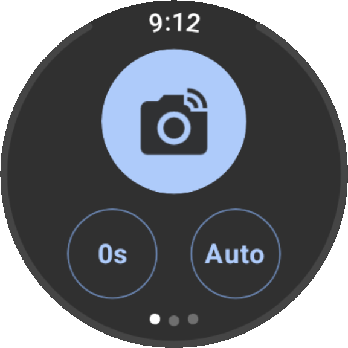

# Camera Remote for Wear OS

This is a Wear OS app to trigger the native camera on your smartphone.
The app works by using the Bluetooth HID Device API from Android.

[Download in the Google Play Store](https://play.google.com/store/apps/details?id=dev.niro.cameraremote)