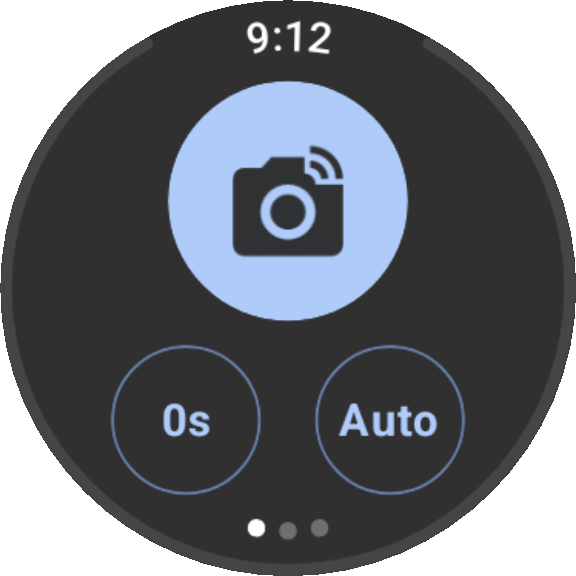

# Camera Remote for Wear OS

This is a Wear OS app to trigger the native camera on your smartphone.

The app works by using the Bluetooth HID Device API from Android,
so your smartwatch is basically emulating a bluetooth keyboard.

## Screenshots

